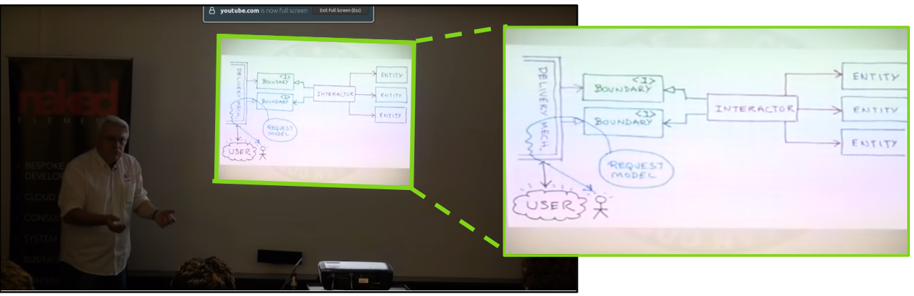

# slide-pipe
Pipe slides you are photographing from a conference / presentation / whatever with your phone directly to your computer clipboard. The pipe not only creates a "shared clipboard" but also pre-processes the image to only get the slide and not all conference participants. 
Here is an example from some of Uncle Bob Martins youtube videos (https://www.youtube.com/watch?v=o_TH-Y78tt4). The input image is the left and the green one gets extracted and piped to the clipboard:

## Prerequisites 
- You need a shared folder between your phone and your computer. I have my own NAS with a WebDAV server running mounted on my computer. Photos are synced automatically to the NAS.
- Create and start a virtual environment

    `python3 -m venv .venv`
    
    `source .venv/bin/activate`
    
- Install Requirements

    `pip install -r requirements.txt`

- On Ubuntu install xclips

    `sudo apt install xclip`

## Getting started
- Start the pipe

    `python3 slide_pipe.py /PATH/TO/SHARED/FOLDER`

## Limitations
- The OpenCV pipeline is currently only suited for 16:9 slides with white background.
- Tested with Ubuntu22.04

## ToDos / Ideas
- Couple the pipe with OCR and extract the text
- Give the text to a custom GPT and extract important notes directy
    -  give equations in Latex

## Notes
The project idea came sitting in a conference taking notes and thought it would be incredible to be able to pipe the slides directly to my computer clipboard. 

## License
This project is licensed under the MIT License - see the [LICENSE](LICENSE) file for details

